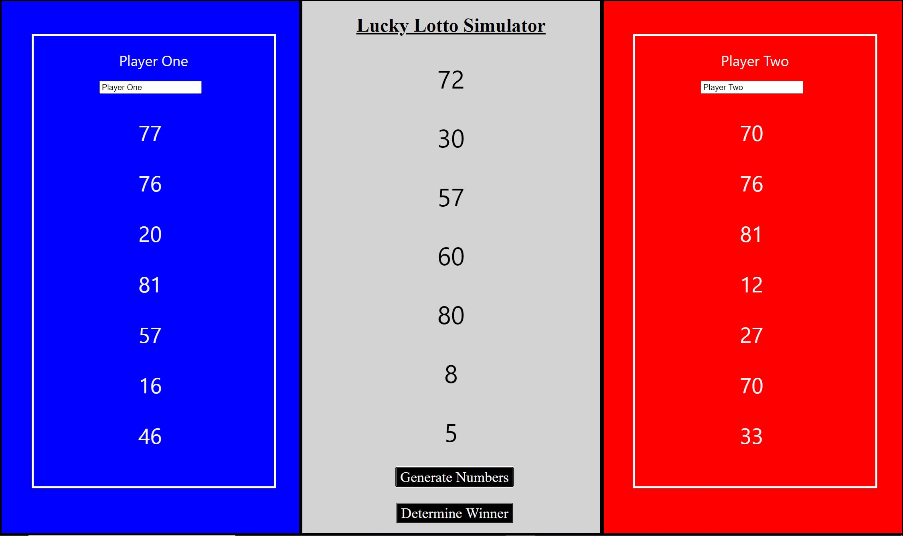

## Lucky Lotto Simulator Web-App

## Languages/Tools/Services Used

This project was created using React (JS Framework for web development), HTML, and CSS. 

NodeJS was used slightly in the background for localhost testing, etc.

Created using Create-react-app.

Hosted freely using Google's Firebase platform.

## About 

This project revolves around luck. Two users verse each other by having seven random numbers generated 
between 0-100. Each of the player's numbers are compared to the generated numbers in the middle. For each respective number,
the closest player to that number wins the round. A player needs to win the majority (4 out of 7 numbers) to win the session.

Press "Generated Numbers" to generate a new set of numbers. Afterwards, press "Determine Winner" to determine the winner of the newly generated numbers. 

This can come very handy when having trouble deciding who does what or how something should be done. For example, which captain gets to choose first in a pick-up basketball game or for a videogame session where 5 people want to play but only 4 are allowed. This is meant to make the tough decisions that we never can. In the end, no one can be blamed for the outcome but the computer. (PS: Computers have no feelings so they won't care if you get mad at them :P)

Hope all your future decision makings are made because of this. 

Good Luck and enjoy!

## Creator

Creator: Mohammed Patel

2nd Year Computer Science & Software Engineering Student at Loyola University Chicago

Lead Website Developer for Blockchain@LUC

Feel free to email me @Mopatel1214@gmail.com for any questions, comments, or concerns. :)
